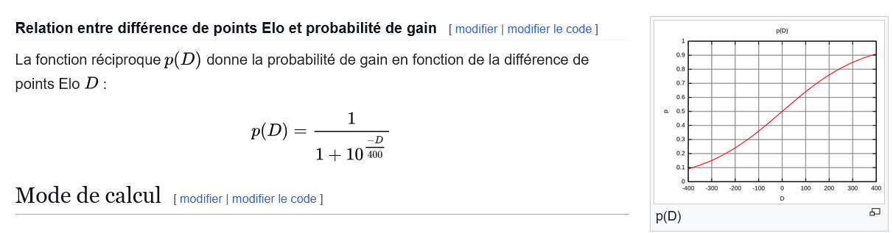

# Test_technique_WeCount

Ce repository contient la solution applicative au test technique ci-joint :

[lien du test technique](https://maze-catmint-61a.notion.site/Code-c462cf227f7f4d73b3c17e2ffba876a3)

Pour la formule de probabilité de victoire, je me suis basé sur cette formule de calcul d'Elo aux échecs :
https://fr.wikipedia.org/wiki/Classement_Elo

Sachant que le diviseur aux échecs est de 400 (pour un Elo allant de 1000 à ~2900) et que, dans notre problématique, les joueurs de tennis ont un niveau allant de 1 à 10, j'ai réglé ce diviseur à une valeur arbitraire de 10 pour des questions de cohérence.

(Un joueur de niveau 10 affrontant un joueur de niveau 1 aurait donc, à chaque échange, 88,8 % de chance de marquer un point.)